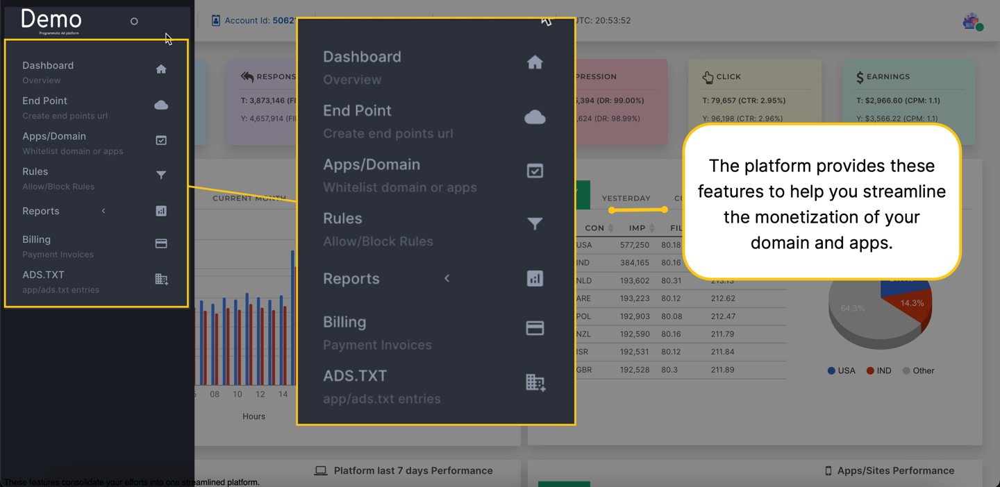

In today's advertising landscape, you often encounter hurdles when it comes to effectively monetizing your websites or apps. These obstacles include navigating complex ad setup processes, accessing high-quality ad inventory, attracting and retaining advertisers, and grappling with low or poor-quality traffic.

To simplify the process of monetization, our Ad Platform Publishers, a supply-side platform (SSP), is designed to address these challenges head-on. Publishers offers an intuitive user interface (GUI) that simplifies the ad management process. With Publishers, you can easily set pricing, configure ad units, and monitor ad performance—all through a single, user-friendly platform.

But what exactly is a Supply-Side Platform (SSP)? Essentially, an SSP serves as a technological bridge between publishers and advertisers. It empowers publishers to manage and sell their digital advertising inventory efficiently. Through our platform, you will gain access to a centralized dashboard where they can view ad inventory, fine-tune pricing and targeting parameters, and seamlessly connect with demand-side platforms (DSPs) and ad networks.

### Benefits of using our platform:
- **Increased revenue**: Our platform can help you increase your revenue by providing access to a wider range of demand sources.

- **Improved efficiency**: Our platform can help you streamline your ad operations by automating many of the tasks involved in selling and managing digital advertising inventory.

- **Greater control**: Our platform gives you more control over your advertising inventory, allowing you to set pricing and targeting parameters and to block or allow specific types of ads.

- **Enhanced reporting**: Our platform provides you with detailed reporting on your ad performance, which can help you track your progress and make informed decisions about your advertising strategy.

### Use cases for our platform
Our platform can be used by the following publishers:
 
- **Website publishers**: Our platform can help website publishers monetize their traffic by selling display, video, and native ads.

- **Mobile app publishers**: Our platform can help mobile app publishers monetize their inventory by selling interstitial, banner, and native ads.

### Capabilities of Publishers platform
Our platform offers a variety of features and capabilities to help you manage and sell your digital advertising inventory:

    <!-- First row with 3 cards -->
    

        

            

                <h4><b>Dashboard</b></h4>
                

                
Access a centralized dashboard to view comprehensive analytics, providing insights into ad performance and audience engagement.

            

        

            

            

                <h4><b>End Points</b></h4>
                

                
Easily create endpoints tailored to the specific types of ads you want to display on your domain or app, ensuring seamless integration with your content.

            

        

        

            

                <h4><b>Apps/Domains</b></h4>
                

                
Whitelist your domain or app endpoints on ad exchanges, enabling you to receive ads based on your bidding preferences and maximizing your revenue potential.

            

        

    

    <!-- Second row with 2 cards -->
    

        

            

                <h4><b>Rules</b></h4>
                

                
Set customizable rules to block or allow specific types of advertisements on your domain or app, giving you control over the ad content displayed to your audience.

            

        

        

            

                <h4><b>Reports</b></h4>
                

                
Access detailed reports on monetization metrics, including successful bids, failed bids, and invalid bids, allowing you to optimize your ad strategy and maximize revenue.

            

        

        

            

                <h4><b>Billings</b></h4>
                

                
View and track payment invoices along with their status, ensuring transparency and facilitating smooth financial transactions between advertisers and publishers.

            

        

    

--- 