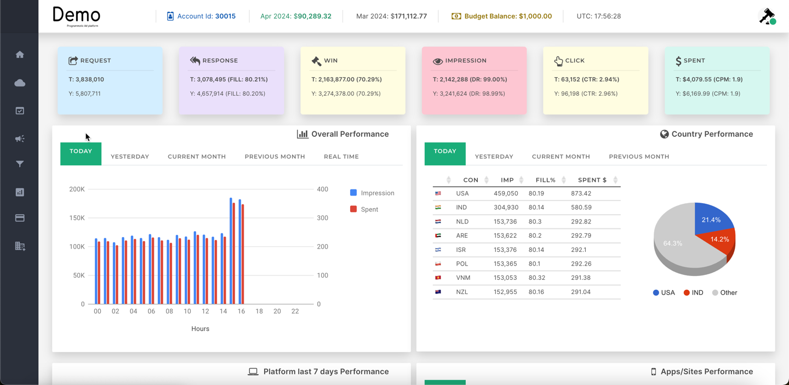

***
> **Note:** This section is under construction. Please check back soon for updates.
***

This dashboard provides a comprehensive view of your advertising performance and earnings. Here's what you'll see:

## Overall Performance

- Today vs. Yesterday: Compare today's stats with yesterday's to quickly spot trends or changes. 
- Month-to-Date: View performance for the current month and the previous month. 
- Real-Time Graph: Get up-to-the-minute updates on impressions and earnings (data refreshes frequently).

### Key Metrics Explained

- **Request**: Number of times ads on your inventory were requested. 
- **Response:** Number of times your inventory responded with an ad. 
- **Fill**: Percentage of requests that resulted in an ad being displayed (e.g., an 80% fill rate means 80 out of 100 ad requests showed an ad). 
- **Win**: Number of times your ads won the bidding process against competing ads. 
- **Impression**: The number of times an ad was actually viewed. 
- **Delivery Rate** (DR): Percentage of winning bids that turned into actual impressions. High DR indicates efficient delivery. 
- **Click:** Number of times users clicked on your ads. 
- **Click-Through Rate** (CTR): Percentage of impressions that resulted in a click. 
- **Earnings**: Revenue generated based on your ad inventory. 
- **Cost Per Mille (CPM)**: Earnings per 1000 impressions.

### Additional Insights

**Country Performance**: Drill down into which countries generate the most impressions, fill rates, and earnings.
**Platform Performance**: Understand how your ads perform across different platforms (e.g., Android banners vs. Android video ads) over the last 7 days.
**Top Apps/Sites**: See your best-performing individual apps or websites in terms of impressions and earnings.