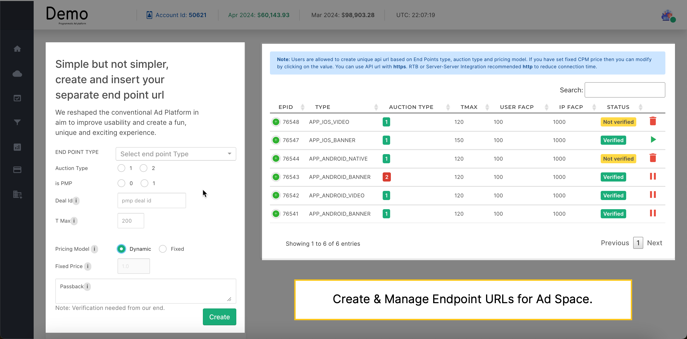
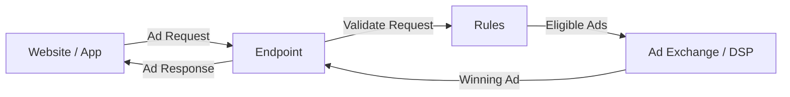
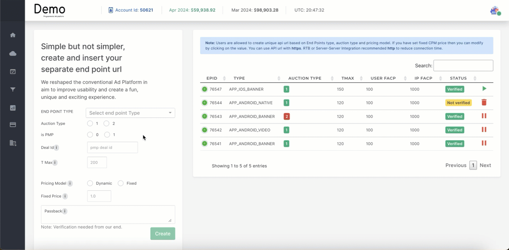

An end point is a configurable ad unit within Publisher. It represents specific ad inventory on your website or app. As a publisher, you use endpoints to:

1. **Define Ad Specifications**:
   a. Ad Type (banner, video, native, etc.)
   b. Available placements (e.g., top banner, in-article video)
2. **Manage Auction Settings**: Select the auction model (first-price, second-price) and set minimum bid floors. 
3. **Control Ad Delivery**:  Endpoints connect advertisers to your inventory, facilitating real-time bidding and ad display.

### How does the End point work?

The end point is a specific URL on the system that's designed to:

- **Receive Ad Requests**: When a user visits a website or app where this end point has been whitelisted, an ad request will be sent to this specific URL on the SSP's servers.

- **Initiate the Bidding Process**: This end point knows how to process that ad request, determine which ads are eligible (based on the targeting parameters like PMP, DEAL ID, etc.), and initiate the auction process.

## How to Create an Endpoint?

To create an Endpoint, you have to configure the following parameters:

1. END POINT TYPE 
2. Auction Type
3. is PMP
4. Deal ID
5. Pricing Model
6. T max 
7. Passback

### End point type

Identifies the type of ad unit or placement this end point represents. It determines what kind of ad creatives (banners, videos, etc.) can be served through this endpoint. Crucial for ensuring the right ad formats are delivered to your app or website. You can choose an
end point from the dropdown list. The end point type represent the following information:

- **Platform:** Site, APP
- **OS**: iOS, Android
- **Ad space type**: Banner, video, Audio, push, Pop, Native

For example, App_Android_Banner, Site_Banner, APP_iOS_Video.

### Auction Type

Selects the type of auction used to determine which ad will be displayed.
Common Options:

- **1** (First-Price Auction): The highest bidder wins and pays their full bid amount. Often used for premium placements where securing the ad spot is a priority.
- **2** (Second-Price Auction): The highest bidder wins but only pays the second-highest bid amount + $0.01. More common for broader inventory to encourage competition.

Considerations: First-price auctions can generate higher revenue, but second-price auctions might attract more bidders. Choosing the right type depends on your goals and the specific placement.

### is PMP (is Private Marketplace)

Indicates whether this end point is part of a Private Marketplace (PMP) deal.
Values:

- **0** (Not PMP): Open to bidding from a wider pool of advertisers through the open Real-Time Bidding (RTB) market.
- **1** (PMP): Limits bidding to a pre-selected group of advertisers who have been invited to participate in the PMP. Often used for premium placements or sponsorships.

Benefits: PMPs offer more control over who sees your ads and potentially higher CPMs (cost per mille - cost per thousand impressions).

### Deal ID

If is PMP is set to 1, this field allows you to specify the unique ID associated with a specific pre-negotiated PMP deal. This ensures only authorized advertisers involved in the specific PMP can bid on this endpoint.

### Pricing Model

Defines how advertisers will be charged for displaying their ads on your platform.
Common Options:

- **Dynamic**: The most common option. Bidding takes place in real-time, and the highest bidder wins.
- **Fixed**: A pre-determined price is set for the ad placement. Often used for sponsorships or very specific ad deals.

_Note_: Dynamic pricing can potentially yield higher revenue, but fixed pricing offers predictability.

### T Max

It measures how quickly an ad system can respond to a request to display an ad on your website or app. This time is recorded in milliseconds (ms), where one millisecond equals one-thousandth of a second. 

- **Ideal**: Below 200ms is considered excellent. This feels almost instant to users.
- **Acceptable**: Many ads fall in the 200-500ms range. This depends on factors like the ad's complexity and the user's internet speed.

### Passback

Provides a backup URL where your user can be redirected if no suitable ad is found for this endpoint. This helps avoid blank ad spaces. This allows users to still see some content even if ad delivery fails.

## Manage Endpoints

After creating an end point, it requires Admin verification before you can activate it. You can see the verification status to know when the verification is complete, and the endpoint's status will change to 'Verified'. From here, you can start, pause, and delete the endpoints.

Next, you can see [Domain/Apps](apps_domain.md) to whitelist your End points.
___
