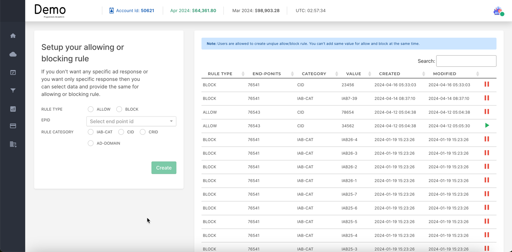

***
> **Note:** This section is under construction. Please check back soon for updates.
***

Rules provide precise control over which ad requests are accepted or rejected for specific endpoints in your SSP.  They function as filters, adding another layer of customization beyond whitelisting. Here's the core difference:

## Allow or Block Specific Ads

You can configure the below parameters to allow/block ad request for specific end points.

### RULE TYPE (ALLOW/BLOCK)

- **ALLOW**: Only ad requests that MATCH the specified criteria will be accepted for this endpoint.

- **BLOCK**: Ad requests that MATCH the specified criteria will be rejected for this endpoint.

- **EPID**: This is the unique Endpoint ID to which the rule will apply.

### RULE CATEGORY

You can allow or block specific ads based on the below Rule Categories:

- **IAB-CAT**: Filter based on IAB content categories (e.g., block ads from IAB-25 - Non-Standard Content category)

- **CID**: This likely stands for "Country ID." You can allow or block ads based on the user's geographic location.

- **CRID**: This might stand for "Creative ID." You could block specific ad creatives if you've identified them as problematic.

- **AD-DOMAIN:** Allows for filtering based on the advertiser's domain.

### Example Use Cases

Below are some example use cases where you would want to implement Rules:

- **Competition Prevention**: Avoid promoting your competitors by setting a BLOCK rule for their specific Creative ID (CRID). 
- **Sensitive Content**: Protect your brand reputation by setting a BLOCK rule for IAB content categories that are unsuitable for your audience. 
- **Geo-Targeting** (ALLOW): Maximize the effectiveness of a localized campaign by creating an ALLOW rule for the target country (CID). 
- **Premium Advertisers** (ALLOW): Ensure your most desirable ad inventory is seen by top-tier advertisers by setting an ALLOW rule for their AD-DOMAINS.
